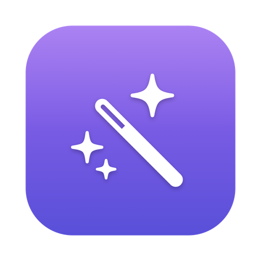
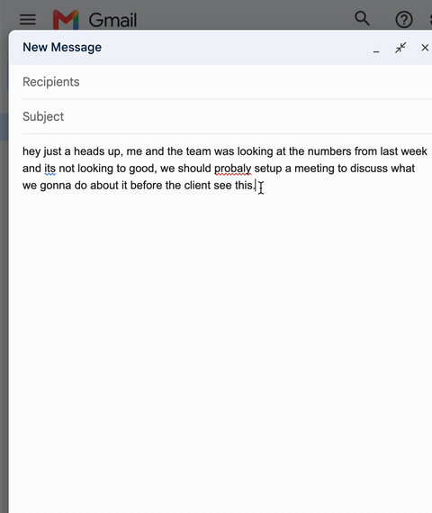
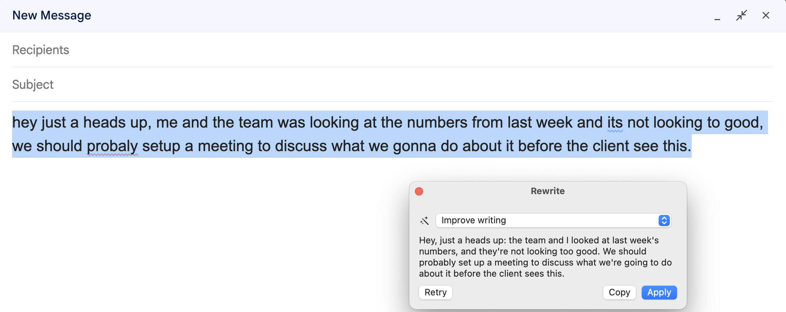
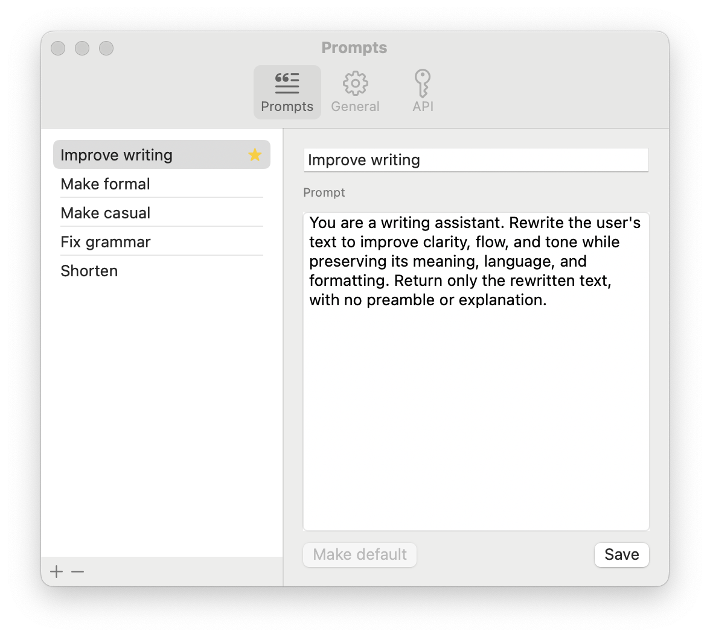
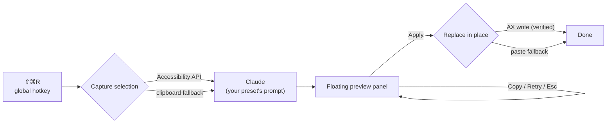

<div align="center">
  

  # Reword

  **Rewrite selected text anywhere on macOS with a hotkey — AI-powered, fully customizable.**

  [](https://github.com/lucmir/reword/actions/workflows/ci.yml)
  
  
  [](LICENSE)

  
</div>

Select text in any app — Slack, Gmail, your editor, a terminal — press **⇧⌘R**, review the AI-rewritten version in a floating panel, and apply it in place. Prompts are fully yours to edit.

## Features

- **Works everywhere** — hybrid text capture: macOS Accessibility API first, with an automatic clipboard-simulation fallback for apps with limited AX support (Electron, Chromium). Replacement even self-verifies: if an app silently ignores the Accessibility write (looking at you, Chromium), Reword detects it and pastes instead.
- **Preview before you apply** — nothing changes until you click Apply. Copy, Retry, or switch the prompt preset right from the panel; Esc dismisses.
- **Your prompts** — ships with five presets (Improve, Formal, Casual, Fix grammar, Shorten); add and edit your own in Settings and pick a default.
- **Bring your own API key** — talks directly to the Anthropic API. Your key lives in the macOS Keychain, never on disk; your text goes to Anthropic and nowhere else.
- **Native and lightweight** — Swift + SwiftUI menu bar app. No Electron, no Dock icon, no background daemon.

<div align="center">
  
  <br><em>The rough draft, and the rewrite — nothing changes until you click Apply.</em>
  <br><br>
  
  <br><em>Edit the built-in presets or add your own.</em>
</div>

## Install

Build from source (requires Xcode 16+ and [XcodeGen](https://github.com/yonaskolb/XcodeGen)):

```bash
git clone https://github.com/lucmir/reword.git
cd reword/App
xcodegen generate
xcodebuild -project Reword.xcodeproj -scheme Reword -configuration Release -derivedDataPath build build
ditto build/Build/Products/Release/Reword.app /Applications/Reword.app
open /Applications/Reword.app
```

### First-run setup

1. **Grant Accessibility permission** — Reword walks you through it on first launch (it's how the app reads your selection and replaces it).
2. **Add your Anthropic API key** — menu bar icon → Settings → API. Get a key at [console.anthropic.com](https://console.anthropic.com). Stored in the Keychain.
3. Select some text anywhere and press **⇧⌘R**.

## How it works



The codebase is split in two:

- **`RewordCore`** — a pure-Swift SwiftPM library with zero AppKit dependencies: the preset store (JSON persistence), the Anthropic provider behind an `AIProvider` protocol, and the capture/replace orchestrator with its fallback logic. Fully unit-tested (25 tests) — `swift test` from the repo root.
- **App target** — everything OS-coupled, generated by XcodeGen: menu bar UI, global hotkey ([KeyboardShortcuts](https://github.com/sindresorhus/KeyboardShortcuts)), real Accessibility/clipboard strategies, the non-activating `NSPanel` preview, SwiftUI settings, Keychain storage.

Design notes worth stealing:

- The preview panel is a **non-activating panel** — it never steals focus from the app you're writing in, so the selection stays alive for the in-place replace. Esc is handled via event monitors since a focusless panel can't receive key events.
- The clipboard fallback **snapshots and restores your full pasteboard** (all types, not just text), guarded by `changeCount` so it never clobbers something you copied in the meantime.
- AX writes are **verified by reading the selection back** — Chromium-based apps report success without applying the write, so a silent no-op triggers the paste path.

## Compatibility

Real Accessibility behavior varies by app; verified by hand:

| App | Capture | Replace |
|---|:---:|:---:|
| TextEdit | ✅ | ✅ |
| Slack | ✅ | ✅ |
| Gmail (Chrome) | ✅ | ✅ |
| Notes | ✅ | ✅ |
| Safari | ✅ | ✅ |
| Mail | ✅ | ✅ |
| Terminal | ✅ | ⚠️ pastes at cursor |

⚠️ Terminals don't expose an editable text selection, so Apply falls back to pasting the rewrite at the cursor rather than replacing the selection.

## Development

```bash
swift test                      # core library tests
cd App && xcodegen generate     # regenerate the Xcode project (gitignored)
```

CI runs the test suite and a full app build on every push.

## Roadmap

- Transformation history
- Streaming responses into the preview panel
- Per-preset hotkeys
- Launch at login + notarized releases
- More providers (OpenAI, local models via Ollama)

## License

[MIT](LICENSE)
